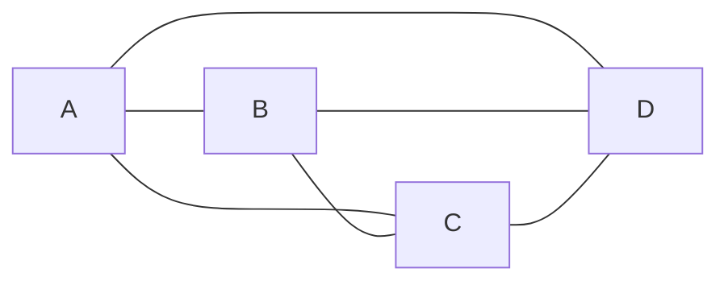
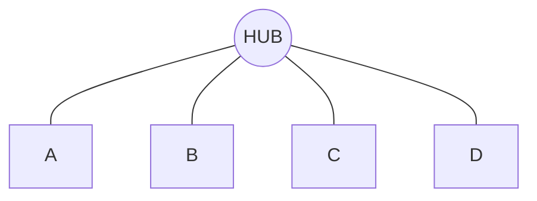
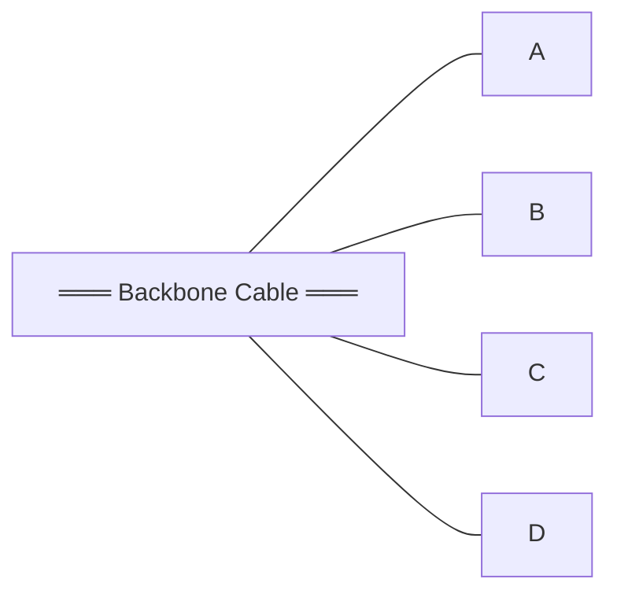
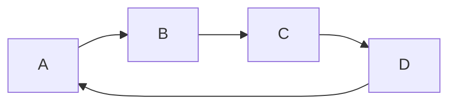
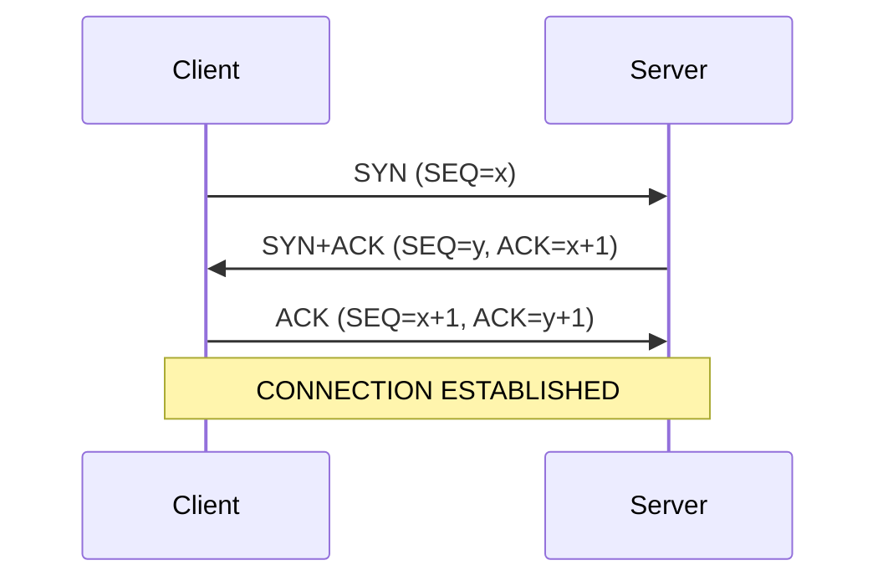

# CC-303 : Computer Networks — March 2026 Internal Exam
## Complete Question & Answer Paper
**Kalol Institute of Computer Studies | BCA SEM-6 | Max Marks: 50**
*All answers based on Tanenbaum's Computer Networks (5th Edition)*

---

# Section – I (Each sub-question carries 5 marks)

---

## Q1. (A) Explain all topology with diagram. (5 marks)

**Network Topology** is the physical or logical arrangement of nodes (devices) and links in a network. It determines how devices communicate and affects performance, reliability, and cost.

### 1. Mesh Topology

- **Every device** has a dedicated point-to-point link to **every other device**.
- For **n** devices → **n(n−1)/2** links are needed.
- **Advantages:** Highly robust (fault tolerant), secure (dedicated links), easy fault isolation.
- **Disadvantages:** Very expensive (too many cables and ports), complex installation.
- **Use:** Backbone connections, military networks.

### 2. Star Topology

- All devices connect to a **central hub or switch**.
- Each device has a **dedicated point-to-point** link to the central node.
- **Advantages:** Easy to install and reconfigure, one link failure doesn't affect others, easy fault detection.
- **Disadvantages:** Hub is a single point of failure; more cabling than bus.
- **Use:** Modern Ethernet LANs.

### 3. Bus Topology

- All devices share a **single backbone cable** with taps and drop lines.
- Signal travels in both directions; **terminators** at both ends absorb signal.
- **Advantages:** Simple to install, less cabling.
- **Disadvantages:** One cable break disables entire network; difficult to add devices; hard to troubleshoot.
- **Use:** Classic Ethernet (10BASE5, 10BASE2).

### 4. Ring Topology

- Each device connects to exactly **two neighbors**, forming a closed loop.
- Data travels in **one direction** (unidirectional); each device acts as a repeater.
- A **token** circulates; a device can transmit only when it holds the token.
- **Advantages:** Orderly access (no collisions), easy to install.
- **Disadvantages:** One device/link failure can break entire ring (unless dual ring).
- **Use:** Token Ring (IEEE 802.5), FDDI.

### 5. Hybrid Topology
- A combination of two or more topologies (e.g., Star-Bus, Star-Ring).
- Used in most **real-world enterprise networks** for flexibility and scalability.

---

## Q1. (B) Explain TCP/IP in detail. (5 marks)

The **TCP/IP (Transmission Control Protocol / Internet Protocol)** model is a 4-layer reference model developed by the U.S. Department of Defense for the ARPANET. It is the actual protocol suite used on the Internet.

### The 4 Layers:

**Layer 1 — Link Layer (Host-to-Network):**
- Handles how data is physically transmitted over the network medium.
- Includes hardware addressing (MAC), framing, and access to the physical medium.
- Not well defined in TCP/IP — depends on the underlying network technology (Ethernet, Wi-Fi, etc.).

**Layer 2 — Internet Layer:**
- Responsible for **logical addressing and routing** of packets across networks.
- Defines the **IP (Internet Protocol)** packet format.
- Uses a **connectionless, best-effort delivery** (datagram model) — each packet is routed independently.
- Key protocol: **IP (IPv4/IPv6)** — determines how packets are addressed and routed.
- Also includes **ICMP** (error reporting) and **ARP** (address resolution).

**Layer 3 — Transport Layer:**
- Provides **end-to-end communication** between source and destination.
- Two main protocols:
  - **TCP (Transmission Control Protocol):** Reliable, connection-oriented, flow control, error recovery, sequencing. Used for: HTTP, FTP, Email.
  - **UDP (User Datagram Protocol):** Unreliable, connectionless, fast, no overhead. Used for: DNS, video streaming, VoIP.

**Layer 4 — Application Layer:**
- Combines OSI's Session, Presentation, and Application layers.
- Contains all higher-level protocols that users interact with:
  - **HTTP** — Web browsing
  - **FTP** — File transfer
  - **SMTP** — Sending email
  - **DNS** — Domain name resolution
  - **Telnet** — Remote login
  - **SSH** — Secure remote access

### Key Design Principles:
1. Built for **survivability** — if routers/links fail, existing connections continue.
2. **Connectionless Internet layer** — no fixed path; packets routed independently.
3. **Flexibility** — supports multiple network types (wired, wireless, fiber).
4. **Protocols came first**, then the model was built around them (practical approach).

### TCP/IP vs OSI:

| Feature | OSI | TCP/IP |
|---------|-----|--------|
| Layers | 7 | 4 |
| Approach | Model first, then protocols | Protocols first, then model |
| Session/Presentation | Separate layers | Part of Application layer |
| Transport | Connection-oriented | Both TCP (reliable) & UDP (unreliable) |
| Widely used | As reference only | On the actual Internet |

---

## Q2. (A) Explain types of multiplexing: FDM, TDM and WDM. (5 marks)

**Multiplexing** is a technique that combines multiple signals for transmission over a single shared link, maximizing utilization.

### 1. Frequency Division Multiplexing (FDM)
- The total **bandwidth of the link is divided into non-overlapping frequency bands**.
- Each signal is modulated onto a **different carrier frequency**.
- **Guard bands** (unused frequency gaps) separate channels to prevent interference.
- All signals are transmitted **simultaneously**, each on its own frequency.
- **Analog technique.**
- **Example:** FM radio stations (each station has its own frequency), cable TV, ADSL.

### 2. Time Division Multiplexing (TDM)
- Each signal gets the **full bandwidth**, but only for a **fixed time slot** in each cycle.
- Time is divided into **frames**; each frame has one slot per input channel.
- **Types:**
  - **Synchronous TDM:** Slots assigned in round-robin; if a source has no data, its slot goes empty (wasted).
  - **Statistical (Asynchronous) TDM:** Slots dynamically allocated to active sources only — more efficient, avoids waste.
- **Digital technique.**
- **Example:** T1 line — 24 channels × 8 bits + 1 framing bit = 193 bits/frame × 8000 frames/sec = 1.544 Mbps.

### 3. Wavelength Division Multiplexing (WDM)
- **FDM applied specifically to optical fiber.**
- Multiple light beams of **different wavelengths (colors)** travel through a single fiber simultaneously.
- A prism or diffraction grating **combines** (mux) and **separates** (demux) the wavelengths.
- Each wavelength carries an independent channel.
- **Dense WDM (DWDM):** 80–160+ channels per fiber with tight wavelength spacing.
- **Example:** Long-distance fiber optic backbone networks (undersea cables).

### Comparison Table:

| Feature | FDM | TDM | WDM |
|---------|-----|-----|-----|
| Division by | Frequency | Time | Wavelength |
| Medium | Analog links | Digital links | Optical fiber |
| Simultaneous | Yes | No (turns) | Yes |
| Guard needed | Guard bands | Sync bits | Guard wavelengths |
| Waste | Unused bands | Empty slots (sync) | Minimal |

---

## Q2. (B) Explain guided transmission media in detail. (5 marks)

**Guided media** use a physical conductor to direct signals from sender to receiver.

### 1. Twisted Pair Cable
- Two **insulated copper wires twisted helically** around each other.
- Twisting **reduces electromagnetic interference** (EMI) and crosstalk.
- Signal is the **difference in voltage** between the two wires (differential signaling).
- **Types:**
  - **UTP (Unshielded Twisted Pair):** No extra shielding, cheaper. Categories: Cat 3 (16 MHz), Cat 5 (100 MHz), Cat 5e, Cat 6 (250 MHz), Cat 7 (600 MHz).
  - **STP (Shielded Twisted Pair):** Metal foil/braid around pairs for extra noise immunity.
- Cat 5: supports 100 Mbps; Cat 5e: 1 Gbps; Cat 6a: 10 Gbps.
- **Used in:** Telephone systems, Ethernet LANs (most common medium).

### 2. Coaxial Cable
- **Structure (inside to outside):** Copper core → Insulating material → Braided metal shield → Protective plastic sheath.
- Better shielding and higher bandwidth than twisted pair.
- **Types:** 50-ohm (digital/Ethernet) and 75-ohm (analog/cable TV).
- Can span longer distances at higher speeds.
- **Used in:** Cable TV, older Ethernet (10BASE5, 10BASE2), MANs.

### 3. Fiber Optic Cable
- Transmits data as **light pulses** through thin glass or plastic fibers.
- Uses principle of **Total Internal Reflection**: light at/above the critical angle is trapped inside the fiber and travels with almost no loss.
- **Three components:** Light source (LED/Laser) → Fiber → Detector (photodiode).
- **Types:**
  - **Multimode:** Larger core (~50μm), multiple light paths, shorter distances.
  - **Single-mode:** Very narrow core (~8-10μm), single path, very long distances (100+ km).
- **Advantages:** Enormous bandwidth (50+ Tbps), immune to EMI, low attenuation, lightweight, secure.
- **Disadvantages:** Expensive, fragile, needs skilled installation, unidirectional (need two fibers or WDM for bidirectional).
- **Used in:** Internet backbone, FttH, high-speed LANs.

---

## Q2. (OR) (A) Explain circuit switching and packet switching. (5 marks)

### Circuit Switching:
- A **dedicated physical path** is established end-to-end **before** data transfer begins.
- Three phases: **(1) Connection setup → (2) Data transfer → (3) Disconnection**.
- The path remains **reserved** for the entire session — bandwidth is guaranteed.
- **Properties:**
  - No queuing delay during transfer (only propagation delay).
  - Bandwidth is **wasted** if either party is silent.
  - Congestion occurs **at setup time** (busy signal if no path available).
  - Less fault tolerant — entire call drops if a switch fails.
- **Example:** Traditional telephone system (PSTN).

### Packet Switching:
- Data is divided into **packets**, each sent independently through the network.
- **No dedicated path** — packets may follow different routes and arrive out of order.
- Uses **store-and-forward**: each router receives the full packet, stores it, and forwards it.
- **Properties:**
  - Bandwidth is **shared** — more efficient, no waste.
  - **Variable delay** (queuing delay at routers).
  - Congestion occurs **during data transfer**.
  - Highly **fault tolerant** — packets can be rerouted around failures.
- **Two sub-types:**
  - **Datagram approach (connectionless):** Each packet routed independently (e.g., IP).
  - **Virtual circuit (connection-oriented):** Path established first, all packets follow it (e.g., ATM).
- **Example:** Internet (IP), ATM networks.

### Key Differences:

| Feature | Circuit Switching | Packet Switching |
|---------|------------------|-----------------|
| Path | Dedicated end-to-end | Shared, dynamic |
| Bandwidth | Reserved (may waste) | On-demand (efficient) |
| Delay | Fixed, low | Variable (queuing) |
| Congestion | At setup | During transfer |
| Fault tolerance | Low | High (rerouting) |
| Best for | Real-time voice | Data/Internet |

---

## Q2. (OR) (B) Define period, frequency, phase, bandwidth and bit rate. (5 marks)

| Term | Definition | Unit |
|------|-----------|------|
| **Period (T)** | The time required to complete **one full cycle** of a signal. T = 1/f | Seconds (s) |
| **Frequency (f)** | The number of **cycles completed per second**. f = 1/T | Hertz (Hz) |
| **Phase (φ)** | The **position** of the waveform at a specific instant relative to a reference (time 0). Describes where in the cycle the signal is. | Degrees (°) or Radians |
| **Bandwidth (B)** | The **range of frequencies** contained in a signal. B = f_max − f_min. Also: the data-carrying capacity of a channel. | Hz (analog) or bps (digital) |
| **Bit Rate** | The number of **bits transmitted per second** over a channel. | bps (bits per second) |

### Important Formulas:
- **Nyquist (noiseless):** Max bit rate = **2B × log₂(V)** (B = bandwidth in Hz, V = signal levels)
- **Shannon (noisy):** Max bit rate = **B × log₂(1 + S/N)** (S/N = signal-to-noise ratio)
- **Baud rate** = symbol rate (signal changes per second); Bit rate = Baud rate × bits/symbol

---

## Q3. (A) Explain ALOHA in detail. (5 marks)

**ALOHA** is one of the earliest multiple access protocols, developed by Norman Abramson at the University of Hawaii (1970s) for wireless packet radio networks.

### Pure ALOHA:
- Users transmit **whenever they have data** — no coordination, no listening.
- If a **collision** occurs (two frames overlap even partially), both are **destroyed**.
- The sender listens for a rebroadcast to confirm success; if not → waits a **random time** and retransmits.
- **Vulnerable period:** **2T** (a frame can collide with any frame that starts within ±1 frame time of its start).
- **Throughput:** S = Ge^(−2G)
- **Maximum efficiency:** At G = 0.5 → S = 1/(2e) ≈ **18.4%**

### Slotted ALOHA:
- Time is divided into **discrete slots**, each equal to one frame time.
- Stations can **only transmit at the beginning of a slot** (requires synchronization).
- **Vulnerable period** is halved: **T** (collision only if two stations choose the same slot).
- **Throughput:** S = Ge^(−G)
- **Maximum efficiency:** At G = 1 → S = 1/e ≈ **36.8%** (double Pure ALOHA)

### Summary:

| Feature | Pure ALOHA | Slotted ALOHA |
|---------|-----------|---------------|
| Time | Continuous | Discrete slots |
| Vulnerable period | 2T | T |
| Max throughput | ~18.4% | ~36.8% |
| Synchronization | Not needed | Required |

### Significance:
- Foundation for modern MAC protocols (Ethernet's CSMA/CD evolved from ALOHA).
- Used in satellite communication, RFID tag identification, and cellular random access channels.

---

## Q3. (B) Explain channelization protocols. (5 marks)

**Channelization protocols** divide the available channel capacity among stations using a fixed allocation strategy. Three main types:

### 1. FDMA (Frequency Division Multiple Access)
- The available **bandwidth is divided into frequency bands**, one per station.
- Each station transmits on its **assigned frequency** continuously.
- **Guard bands** separate channels to prevent interference.
- Similar to FDM applied to multiple access.
- **Used in:** 1G analog cellular (AMPS), radio broadcasting.
- **Advantage:** Simple, no coordination needed.
- **Disadvantage:** Inefficient if station has no data (frequency slot is wasted).

### 2. TDMA (Time Division Multiple Access)
- Stations share the **same frequency** but transmit in **different time slots**.
- Time is divided into frames; each frame has fixed slots assigned to each station.
- Stations transmit only during their assigned slot.
- **Used in:** 2G digital cellular (GSM), satellite communication.
- **Advantage:** Supports multiple users on one frequency.
- **Disadvantage:** Requires precise synchronization; slots wasted if station is silent.

### 3. CDMA (Code Division Multiple Access)
- All stations transmit **simultaneously** on the **same frequency** using the full bandwidth.
- Each station is assigned a **unique code (chip sequence)** — an orthogonal binary pattern.
- Each bit time is subdivided into **m** short intervals called **chips** (typically 64 or 128 chips per bit).
- To send a 1-bit, station transmits its chip code; to send a 0-bit, it transmits the **complement** of its code.
- The receiver **extracts** the desired station's data by computing the normalized inner product of the received signal with the station's chip code.
- Due to orthogonality, other stations' signals cancel out as noise.
- **Used in:** 3G cellular (UMTS/WCDMA, CDMA2000), GPS.
- **Advantages:** All users share full bandwidth, soft handoff, increased capacity during silences, resistance to interference and tapping.
- **Disadvantages:** Complex implementation, requires power control (near-far problem).

### Comparison:

| Feature | FDMA | TDMA | CDMA |
|---------|------|------|------|
| Shares by | Frequency | Time | Code |
| Bandwidth per user | Fixed band | Full (in time slot) | Full (all time) |
| Interference | Guard bands | Guard times | Code orthogonality |
| Synchronization | No | Yes | Minimal |
| Complexity | Low | Medium | High |

---

## Q3. (OR) (A) Explain error detection techniques. (5 marks)

Error detection identifies whether transmitted data has been corrupted during transmission.

### 1. Parity Check
- Appends a **single parity bit** to make total 1s even (even parity) or odd (odd parity).
- **Example:** Data = 1011010 (four 1s) → Even parity bit = 0 → Sent: 10110100.
- **Detects:** All single-bit errors. **Cannot detect:** Even number of errors.
- **Interleaving:** Parity computed column-wise across a matrix of data — detects burst errors up to n bits (where n = number of columns).

### 2. Checksum
- A **running sum** of data words (e.g., 16-bit Internet checksum).
- Sender computes checksum and appends its complement.
- Receiver recomputes — if result = 0, no error.
- Stronger than simple parity; detects some multi-bit errors.
- Used in IP, TCP, UDP headers.

### 3. CRC (Cyclic Redundancy Check)
- The most powerful error-detecting code at the link layer.
- Treats the frame as a **polynomial M(x)** and divides by a **generator polynomial G(x)** using modulo-2 arithmetic (XOR).
- **Steps:** (1) Append r zeros to frame (r = degree of G(x)). (2) Divide by G(x). (3) XOR remainder with appended frame → transmitted frame.
- Receiver divides by G(x): if remainder = 0, no error.
- **CRC-32** (used in Ethernet): detects all bursts ≤ 32 bits, all single-bit errors, all double-bit errors, all odd-bit errors.
- Implemented efficiently in hardware using shift registers.

---

## Q3. (OR) (B) Explain stop-and-wait protocols. (5 marks)

**Stop-and-Wait** is the simplest error recovery protocol at the data link layer. It is also called **ARQ (Automatic Repeat reQuest)** or **PAR (Positive Acknowledgement with Retransmission)**.

### How It Works:
1. Sender sends **one frame** to the receiver.
2. Sender **stops and waits** for an acknowledgement (ACK).
3. If **ACK received** → sender sends the next frame.
4. If **timeout** (ACK lost or frame damaged) → sender **retransmits** the same frame.

### Sequence Numbers:
- Uses a **1-bit sequence number** (0 or 1) — alternates between frames.
- This solves the **duplicate frame problem**: if the ACK is lost, the sender retransmits, and the receiver can detect the duplicate by checking the sequence number.
- If received sequence number = expected → accept and pass to network layer, send ACK.
- If received sequence number ≠ expected → it's a duplicate; discard but still send ACK.

### Timer:
- Sender starts a **timer** after sending each frame.
- Timer interval must be long enough for: frame propagation + processing + ACK return.
- If too short → unnecessary retransmissions.

### Advantages:
- Very simple to implement.
- Works correctly even with frame loss, ACK loss, and duplicate frames.

### Disadvantages:
- **Inefficient** — sender sits idle while waiting for ACK.
- Poor utilization on long-distance or high-bandwidth links (large bandwidth-delay product).
- Only sends **one frame at a time** — no pipelining.

---

## Q4. (A) Explain TCP connection. (5 marks)

**TCP (Transmission Control Protocol)** is a reliable, connection-oriented transport protocol that provides guaranteed, ordered delivery of data between applications.

### TCP Connection Establishment — Three-Way Handshake:

1. **Step 1 (SYN):** Client sends a segment with **SYN=1, ACK=0**, and an initial sequence number (x).
2. **Step 2 (SYN+ACK):** Server responds with **SYN=1, ACK=1**, its own sequence number (y), and acknowledges client's sequence (ACK=x+1).
3. **Step 3 (ACK):** Client sends **ACK=1** with ACK=y+1. Connection is now **ESTABLISHED**.

### TCP Connection Release — Four-Way Handshake:

Since TCP is **full-duplex**, each direction is closed independently:

1. Side A sends **FIN** → "I have no more data to send."
2. Side B sends **ACK** → "Received your FIN."
3. Side B sends **FIN** → "I'm also done sending."
4. Side A sends **ACK** → "Acknowledged." (Enters TIME_WAIT, then CLOSED.)

### TCP Features:
- **Reliable delivery:** Uses sequence numbers, ACKs, and retransmission timers.
- **Flow control:** Variable-size sliding window (receiver advertises window size).
- **Congestion control:** Slow start, congestion avoidance, fast retransmit.
- **Full-duplex:** Data flows in both directions simultaneously.
- **Byte-stream service:** TCP sees data as a continuous stream of bytes.

### TCP Header Key Fields:
- Source/Destination **Port** (16 bits each) — identifies application.
- **Sequence Number** (32 bits) — byte position of first data byte.
- **Acknowledgement Number** (32 bits) — next expected byte.
- **Window Size** (16 bits) — receiver's available buffer space.
- **Flags:** SYN, ACK, FIN, RST, PSH, URG.
- **Checksum** — covers header + data + pseudoheader.

---

## Q4. (B) Explain flooding algorithm. (5 marks)

**Flooding** is a simple routing technique in the network layer where every incoming packet is sent out on **every outgoing line except the one it arrived on**.

### How It Works:
1. A source router sends a packet to all its neighbors.
2. Each neighbor forwards the packet to **all of its neighbors** (except the one it came from).
3. This continues until the packet reaches every node in the network.

### Problem — Infinite Duplicates:
Without control, flooding generates an **exponential number of duplicate packets** (and potentially infinite loops).

### Solutions to Control Flooding:

**Method 1: Hop Counter**
- Each packet has a **hop counter** in its header, initialized to the network diameter (maximum path length).
- At each router, the counter is **decremented by 1**.
- When counter reaches **0**, the packet is **discarded**.
- This limits the number of hops but can still produce many duplicates.

**Method 2: Sequence Numbers**
- The source puts a **unique sequence number** in each packet.
- Each router maintains a **list per source** of sequence numbers already seen.
- If an incoming packet's sequence number is already in the list → **discard** (duplicate).
- A counter k summarizes that all sequence numbers ≤ k have been seen, preventing unbounded list growth.

### Advantages of Flooding:
1. **Guaranteed delivery:** If any path exists, flooding will find it.
2. **Shortest path:** Always discovers the shortest route (tries all paths in parallel).
3. **Extremely robust:** Works even if many routers are destroyed (e.g., military networks in war zones).
4. **Simple:** Routers only need to know their neighbors — no routing tables needed.
5. **Useful as a benchmark:** Other algorithms can be compared against flooding.
6. **Broadcasting:** Effectively delivers a packet to every node in the network.

### Disadvantages:
1. **Wastes bandwidth** — many duplicate packets.
2. **Wastes processing** — routers handle many unnecessary packets.
3. **Not practical** for regular data traffic — used mainly for broadcasting, route discovery, and as a building block.

### Applications:
- Broadcasting information to all nodes.
- Route discovery in ad-hoc/wireless networks.
- Military/emergency communication (maximum reliability).
- Metric for comparing routing algorithm performance.

---

## Q4. (OR) (A) Explain IPv4 addressing and class A, B, C. (5 marks)

### IPv4 Addressing:
- Every device on the Internet is identified by a **32-bit IP address**.
- Written in **dotted decimal notation**: e.g., 192.168.1.1
- Each of the four octets ranges from **0 to 255**.
- The address is divided into **Network ID** (identifies the network) and **Host ID** (identifies the device).

### Classful Addressing:

| Class | Leading Bits | Address Range | Network Bits | Host Bits | # Networks | # Hosts/Network |
|-------|-------------|--------------|-------------|----------|-----------|----------------|
| **A** | 0 | 0.0.0.0 – 127.255.255.255 | 8 | 24 | 128 | ~16.7 million |
| **B** | 10 | 128.0.0.0 – 191.255.255.255 | 16 | 16 | 16,384 | ~65,534 |
| **C** | 110 | 192.0.0.0 – 223.255.255.255 | 24 | 8 | ~2.1 million | 254 |
| **D** | 1110 | 224.0.0.0 – 239.255.255.255 | — | — | Multicast | — |
| **E** | 1111 | 240.0.0.0 – 255.255.255.255 | — | — | Reserved/Experimental | — |

### Key Points:
- **Class A:** Few networks, many hosts per network → large organizations.
- **Class B:** Medium networks → universities, companies.
- **Class C:** Many networks, few hosts → small organizations.
- **Class D:** Multicast (group communication).
- **Special addresses:** 127.x.x.x = loopback; 0.0.0.0 = "this network"; host bits all 1s = broadcast.

---

## Q4. (OR) (B) Explain flooding algorithm. (5 marks)

*(Same as Q4(B) above — refer to the flooding algorithm answer.)*

---

# Section – II (Attempt any TEN — 10 marks, 1 mark each)

---

### 1. TCP/IP model has how many layers?
**Answer: 4 layers** (Link, Internet, Transport, Application)

### 2. Which multiplexing uses time slots?
**Answer: TDM (Time Division Multiplexing)**

### 3. Which switching uses dedicated path?
**Answer: Circuit Switching**

### 4. Parity check detects?
**Answer: Single-bit errors**

### 5. CRC stands for?
**Answer: Cyclic Redundancy Check**

### 6. IPv4 address size is?
**Answer: 32 bits (4 bytes)**

### 7. HTTP is used for?
**Answer: Transferring web pages (HyperText Transfer Protocol)**

### 8. SMTP is used for?
**Answer: Sending email (Simple Mail Transfer Protocol)**

### 9. Byte stuffing is used in?
**Answer: Framing at the Data Link Layer** (to distinguish frame boundaries by inserting escape bytes before special characters in the data)

### 10. In mesh topology, each device connected to?
**Answer: Every other device** (dedicated point-to-point link to all other nodes)

### 11. Frequency is measured in?
**Answer: Hertz (Hz)**

### 12. Loss of signal strength is called?
**Answer: Attenuation**

---

*End of 2026 Internal Paper — Complete Answers*
