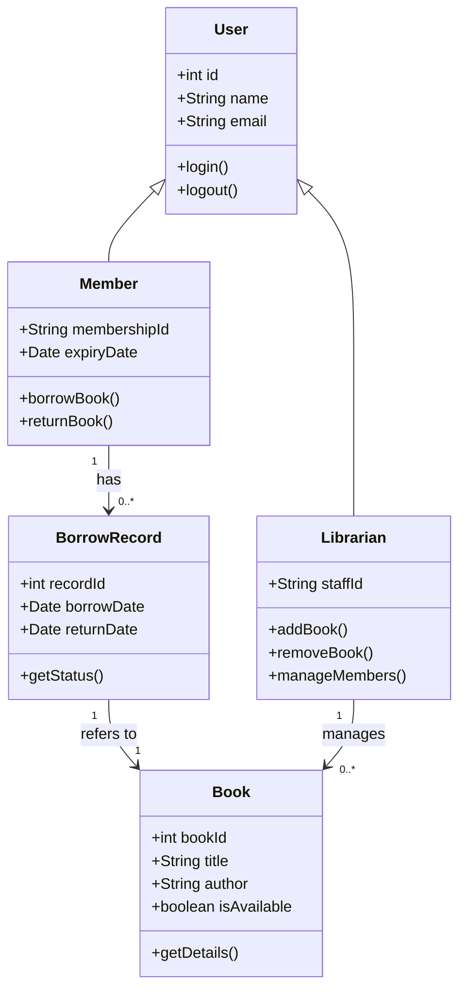
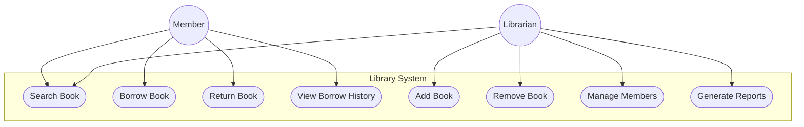

# UML Diagrams

## 1. UML Class Diagram

A simple class diagram for an **Online Library System**.

---

## 2. Use Case Diagram

A simple use case diagram for the same **Online Library System**.

> **Note:** These diagrams use [Mermaid](https://mermaid.js.org/) syntax.
> They render automatically in GitHub, GitLab, Notion, Obsidian, and many other markdown viewers.

---

## Summary

| Diagram        | Purpose                                      |
|----------------|----------------------------------------------|
| Class Diagram  | Shows structure — classes, attributes, relationships |
| Use Case Diagram | Shows behavior — who does what in the system |
