# 🎓 System Analysis, Design & Development — Exam Preparation Guide

## BCA Semester 6 | April 2026 Examination | Predicted Questions & Model Answers

---

# 📊 PART A: TREND ANALYSIS

## Cross-Reference Matrix: Papers × Question Bank

| # | Topic | Apr 2022 | Apr 2023 | Nov 2025 | SE 35 Q-Bank | **Priority** |
|---|-------|:--------:|:--------:|:--------:|:------------:|:------------:|
| 1 | Waterfall Model | ✅ Q1A | ✅ Q1(i) | ❌ | ✅ Q4 | ⭐⭐⭐ |
| 2 | Spiral Model | ❌ | ✅ Q1-OR(i) | ❌ | ✅ Q2 | ⭐⭐⭐ |
| 3 | Feasibility Study | ❌ | ✅ Q1-OR(ii) | ✅ Q1(1) | ✅ Q16 | ⭐⭐⭐ |
| 4 | Fact-Finding Techniques | ✅ Q1B | ✅ Q1(ii) | ✅ Q1-OR(2) | ❌ | ⭐⭐⭐ |
| 5 | Use Case Diagram | ✅ Q2B | ✅ Q2(i) | ✅ Q2(2) | ✅ Q18 | ⭐⭐⭐ |
| 6 | Activity Diagram | ✅ Q3A | ✅ Q3(i)(ii) | ✅ Q4(1) | ✅ Q19 | ⭐⭐⭐ |
| 7 | Class Diagram | ✅ Q3B | ✅ Q3-OR(i) | ✅ Q3(1)(2) | ✅ Q22 | ⭐⭐⭐ |
| 8 | Sequence Diagram | ❌ | ✅ Q2-OR(i) | ✅ Q2-OR(2) | ✅ Q20 | ⭐⭐⭐ |
| 9 | Quality / QA / QC | ✅ Q4A | ✅ Q4(i) | ❌ | ✅ Q30 | ⭐⭐⭐ |
| 10 | White Box vs Black Box Testing | ✅ Q4B | ✅ Q4(ii) | ❌ | ✅ Q25-27 | ⭐⭐⭐ |
| 11 | Aggregation / Composition / Generalization | ❌ | ✅ Q3-OR(ii) | ✅ Q2(1), Q3(1) | ✅ (in Q-Bank) | ⭐⭐⭐ |
| 12 | DFD (Data Flow Diagram) | ❌ | ❌ | ✅ Q1(2) | ✅ Q23 | ⭐⭐ |
| 13 | State-Chart Diagram | ❌ | ❌ | ✅ Q4(2), Q4-OR(1) | ✅ Q21 | ⭐⭐ |
| 14 | Object Diagram | ❌ | ❌ | ✅ Q3(2), Q3-OR(2) | ❌ | ⭐⭐ |
| 15 | Data Dictionary | ❌ | ❌ | ✅ Q1-OR(1) | ❌ | ⭐⭐ |
| 16 | Verification vs Validation | ❌ | ❌ | ❌ | ✅ Q29 | ⭐ |
| 17 | Integration / Performance Testing | ❌ | ✅ Q4-OR | ❌ | ✅ Q28 | ⭐ |
| 18 | Requirement Engineering / SRS | ❌ | ❌ | ❌ | ✅ Q14,17 | ⭐ |
| 19 | COCOMO Model | ❌ | ❌ | ❌ | ✅ Q11 | ⭐ |
| 20 | DevOps / SCM | ❌ | ❌ | ❌ | ✅ Q33,36-38 | ⭐ |

> [!IMPORTANT]
> **Key Insight**: Topics 1–11 (⭐⭐⭐) appeared in **2+ papers AND** the question bank. These form the **core exam syllabus** and should be your priority. The 2025 paper shifts focus toward **Object Diagrams, State-Chart Diagrams, and DFD** — expect these to continue.

---

# 🎯 PART B: TOP 10 PREDICTED QUESTIONS WITH MODEL ANSWERS

---

# Q1. Explain the Waterfall Model in detail with its advantages and disadvantages.

> **Probability: 🔴 VERY HIGH** — Asked in 2022, 2023, and present in Q-Bank (Q4)

## 1.1 Introduction & Definition

The **Waterfall Model** is the earliest and most fundamental **Software Development Life Cycle (SDLC)** model. It was introduced by **Winston W. Royce** in 1970. It follows a **linear sequential approach** where each phase must be completed before the next begins, with no overlap or iteration. It is also known as the **"Linear Life Cycle Model"** or **"Classic Life Cycle Model"**.

## 1.2 Phases of the Waterfall Model

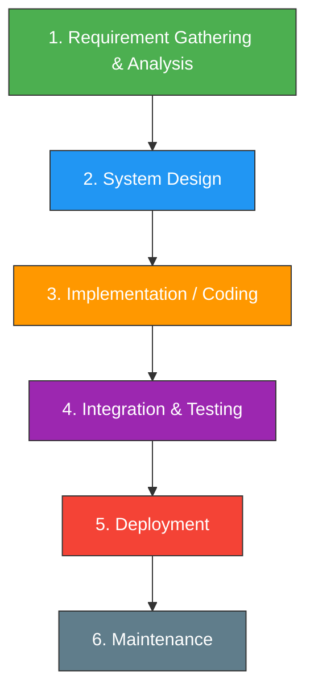

1. **Requirement Gathering & Analysis**: All possible requirements of the system are captured and documented in a **Requirement Specification Document (SRS)**.
2. **System Design**: The requirement specifications are studied, and the **system architecture** is prepared. This defines hardware, system requirements, and overall architecture.
3. **Implementation (Coding)**: The system is developed in small units called **modules**. Each unit is developed and tested individually (**Unit Testing**).
4. **Integration & Testing**: All units are integrated into the complete system. The entire system is tested for **faults, failures, and defects**.
5. **Deployment**: After functional and non-functional testing, the product is **deployed** to the customer environment or released to the market.
6. **Maintenance**: Issues discovered in the client environment are fixed. **Patches** and **new versions** are released for enhancement.

## 1.3 Advantages

| # | Advantage |
|---|-----------|
| 1 | **Simple and easy to understand** and implement |
| 2 | **Minimal resources** are required |
| 3 | Requirements are **clearly defined** and remain unchanged |
| 4 | **Fixed start and end points** for each phase make progress tracking easy |
| 5 | **Release date and cost** can be determined before development begins |
| 6 | Provides **clarity to the customer** through strict reporting |

## 1.4 Disadvantages

| # | Disadvantage |
|---|-------------|
| 1 | **High risk** — not suitable for large and complex projects |
| 2 | **Cannot accept changes** in requirements during development |
| 3 | **Difficult to go back** to a previous phase once completed |
| 4 | **Testing is done late** — bugs are detected only at the end |
| 5 | **No working software** is produced until late in the cycle |
| 6 | Not suitable for projects with **unclear or evolving requirements** |

## 1.5 When to Use

- Requirements are **well-documented, clear, and fixed**
- **Technology is well-understood** and stable
- **Short project** with no ambiguous requirements
- Resources with required expertise are **freely available**

---

# Q2. Explain the Spiral Model in detail with its advantages and disadvantages.

> **Probability: 🔴 VERY HIGH** — Asked in 2023, present in Q-Bank (Q2)

## 2.1 Introduction & Definition

The **Spiral Model** was proposed by **Barry Boehm** in 1986. It is an **evolutionary software process model** that couples the **iterative nature of prototyping** with the controlled and **systematic aspects of the waterfall model**. It provides the potential for **rapid development** of increasingly complete versions of software. Each pass through the spiral represents a **complete phase** of development.

## 2.2 Phases of the Spiral Model

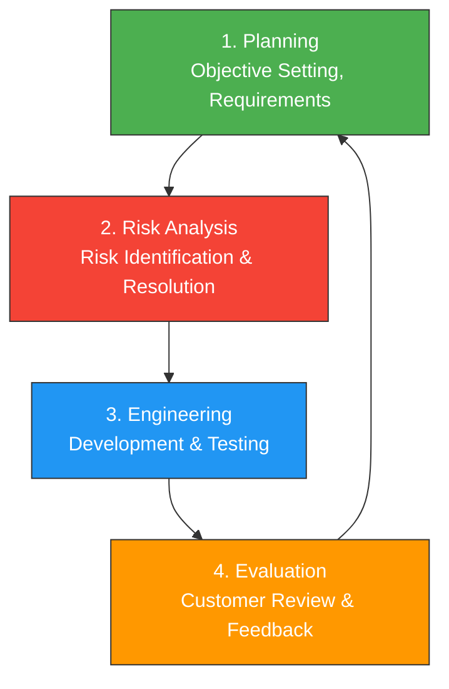

1. **Planning (Objective Setting)**: Requirements are gathered and objectives are determined. **Cost and schedule** are estimated based on feedback from previous iterations.
2. **Risk Analysis**: Risks are identified, evaluated, and resolved. **Prototypes** may be built to reduce risk. This is the **most critical phase** of the Spiral Model.
3. **Engineering (Development)**: The actual software is developed and tested. This includes **design, coding, and testing** activities.
4. **Evaluation (Customer Review)**: The customer evaluates the software and provides **feedback**. Based on this, the next iteration is planned.

## 2.3 When to Use Spiral Model

- For **large-scale / high-risk** projects
- When **cost and risk evaluation** is important
- Users are **unsure of their needs**
- Requirements are **complex**
- **New product line** development
- **Significant changes** are expected

## 2.4 Advantages

| # | Advantage |
|---|-----------|
| 1 | **High amount of risk analysis** — enhanced risk avoidance |
| 2 | **Strong approval and documentation** control |
| 3 | **Additional functionality** can be added at a later date |
| 4 | **Software is produced early** in the life cycle |
| 5 | Suitable for **large and mission-critical** projects |

## 2.5 Disadvantages

| # | Disadvantage |
|---|-------------|
| 1 | Can be a **costly model** to use |
| 2 | **Risk analysis requires highly specific expertise** |
| 3 | Project success is **highly dependent on the risk analysis phase** |
| 4 | **Doesn't work well** for smaller projects |

---

# Q3. Define Feasibility Study. Explain the types of feasibility.

> **Probability: 🔴 VERY HIGH** — Asked in 2023, 2025, present in Q-Bank (Q16)

## 3.1 Introduction & Definition

A **Feasibility Study** is a preliminary analysis conducted to determine the **viability** of a proposed system. It establishes the **basic business requirements and constraints** associated with the application to be built and determines whether the solution considered is **practical and workable**.

## 3.2 Things Studied in Feasibility

- **Resource availability**
- **Cost estimation** for software development
- **Benefits** of the software after development
- **Maintenance cost**

## 3.3 Types of Feasibility

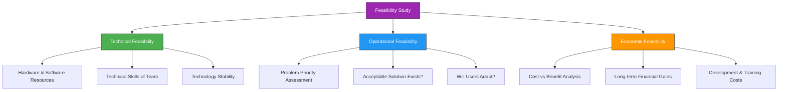

### 3.3.1 Technical Feasibility

- Checks the **capability of converting ideas** into working systems
- Evaluates current **hardware and software resources** and technology
- Analyzes the **technical skills and capabilities** of the development team
- Checks whether the relevant **technology is stable**
- Verifies if **consultation is possible** if problems arise

### 3.3.2 Operational Feasibility

- Tests the **operational scope** of the software to be developed
- Assesses extent to which software is **useful to solve business problems** and user requirements
- Focuses on:
  - Whether **problems faced are of high priority**?
  - Are there **acceptable solutions**?
  - **Will users adapt** to new software?
- Mainly dependent on the **development team** and **visualization of installed software**

### 3.3.3 Economic Feasibility

- Evaluates the **cost of software development** against the **ultimate income/benefits**
- Determines whether software is capable of **generating financial gains**
- Focuses on:
  - Producing **long-term gains**
  - **Cost of requirements** elicitation and analysis
  - Cost of **hardware, software, team, and training**
- Involves:
  - Cost of **development team**
  - Estimated cost of **hardware and software**
  - Cost of **feasibility study itself**

---

# Q4. Explain Use Case Diagram elements and draw a Use Case Diagram for a given scenario.

> **Probability: 🔴 VERY HIGH** — Asked in ALL 3 papers + Q-Bank (Q18)

## 4.1 Introduction & Definition

A **Use Case Diagram** is a **behavioral UML diagram** that describes the **functionality** of a system from the **user's perspective**. It captures the **interactions** between **actors** (users or external systems) and the system's **use cases** (functionalities). It was introduced by **Ivar Jacobson** as part of the **Unified Modeling Language (UML)**.

## 4.2 Elements of Use Case Diagram

| # | Element | Symbol | Description |
|---|---------|--------|-------------|
| 1 | **Actor** | Stick Figure | External entity that interacts with the system (user, device, external system) |
| 2 | **Use Case** | Oval/Ellipse | A function or service provided by the system |
| 3 | **System Boundary** | Rectangle | Defines the scope/boundary of the system |
| 4 | **Association** | Solid Line | Connects an actor to a use case |
| 5 | **Include** | Dashed arrow with `<<include>>` | Mandatory dependency — one use case always includes another |
| 6 | **Extend** | Dashed arrow with `<<extend>>` | Optional dependency — one use case may optionally extend another |
| 7 | **Generalization** | Solid line with hollow triangle | Parent-child (inheritance) relationship between actors or use cases |

## 4.3 Relationships Explained

- **Include (`<<include>>`)**: Use case A **always** invokes use case B. Example: "Place Order" **includes** "Login".
- **Extend (`<<extend>>`)**: Use case B **optionally** extends use case A. Example: "Search Product" is **extended by** "Apply Filter".
- **Generalization**: A **specialized** actor/use case inherits from a **general** one. Example: "Admin" generalizes "User".

## 4.4 Use Case Diagram — Library Management System

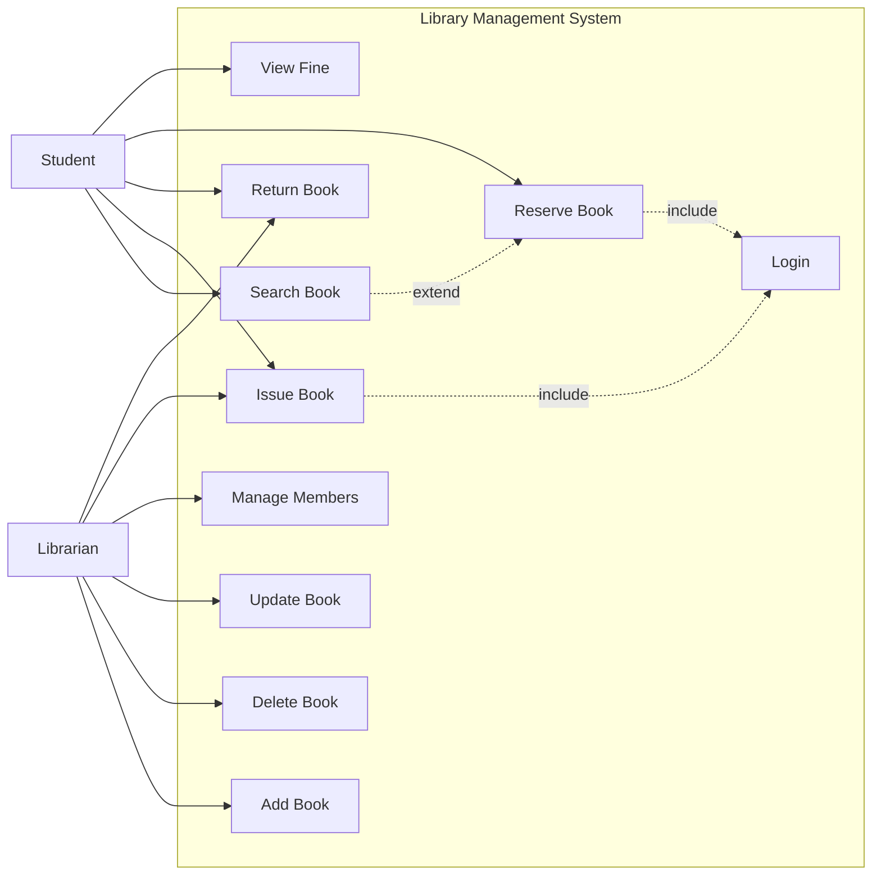

## 4.5 Use Case Diagram — Online Shopping System

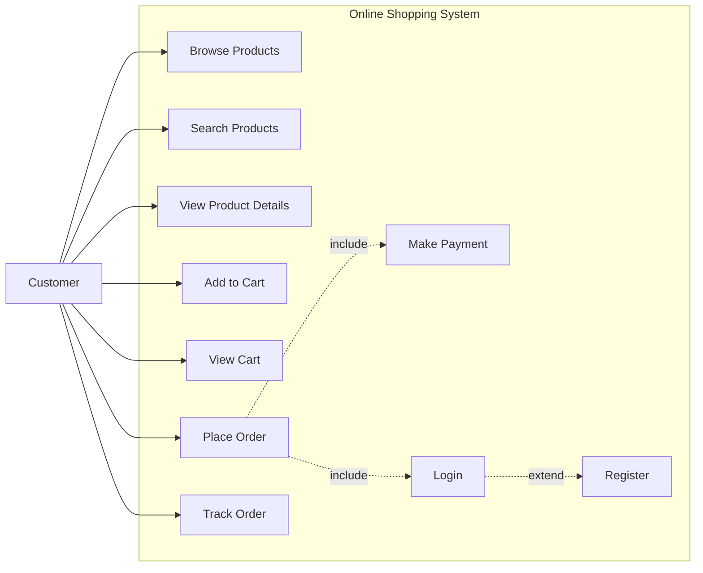

---

# Q5. Explain Activity Diagram elements and draw an Activity Diagram for a given scenario.

> **Probability: 🔴 VERY HIGH** — Asked in ALL 3 papers + Q-Bank (Q19)

## 5.1 Introduction & Definition

An **Activity Diagram** is a **behavioral UML diagram** that represents the **workflow** or **flow of control** from one activity to another. It shows the **sequence of steps**, **decision points**, **parallel activities**, and **control flow** in a system. Activity diagrams are most useful during the **initial stages of design**.

## 5.2 Elements of Activity Diagram

| # | Element | Symbol | Description |
|---|---------|--------|-------------|
| 1 | **Initial State** | Filled black circle | Starting point of the activity |
| 2 | **Final State** | Filled circle inside circle | End point of the activity |
| 3 | **Activity/Action State** | Rounded rectangle | Represents a single step/action |
| 4 | **Decision Node** | Diamond | Branching point with conditions (guards) |
| 5 | **Merge Node** | Diamond | Merging point where branches join |
| 6 | **Fork** | Thick horizontal bar | Splits single flow into **parallel** flows |
| 7 | **Join** | Thick horizontal bar | Synchronizes **parallel** flows back into one |
| 8 | **Transition/Flow** | Arrow | Shows the flow direction |
| 9 | **Swim Lane** | Vertical/horizontal partition | Divides activities by **responsible actor/department** |
| 10 | **Guard Condition** | `[condition]` on arrow | Boolean condition for a transition |

## 5.3 Swim Lane Diagram

A **Swim Lane Diagram** divides the activity diagram into **sections** (lanes). Each lane represents a **particular organisation, actor, or department** responsible for the activities within it. It combines the **activity diagram's depiction of logic** with the **interaction diagram's depiction of responsibility**.

> [!TIP]
> Guidelines: Keep swim lanes to a maximum of 5. Order them logically. Each activity belongs to exactly one lane.

## 5.4 Activity Diagram — Online Shopping (Customer)

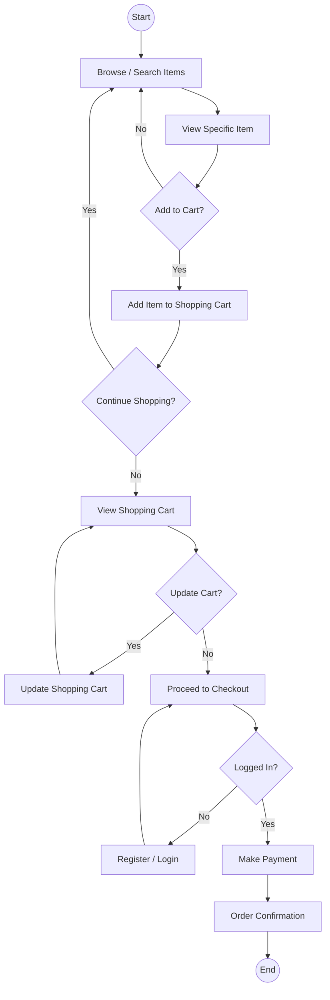

## 5.5 Activity Diagram — College Admission System

```mermaid
flowchart TD
    Start(("Start")) --> Apply["Student Submits Application Form"]
    Apply --> Verify["College Verifies Documents"]
    Verify --> Decision{"Documents Valid?"}
    Decision -->|No| Reject["Application Rejected"]
    Reject --> Notify1["Notify Student - Rejected"]
    Decision -->|Yes| Merit["Check Merit / Eligibility"]
    Merit --> AdmDec{"Admission Granted?"}
    AdmDec -->|No| WaitList["Put on Waiting List"]
    WaitList --> Notify2["Notify Student - Waitlisted"]
    AdmDec -->|Yes| Fees["Student Pays Fees"]
    Fees --> Enroll["Student Enrolled"]
    Enroll --> Notify3["Issue Admission Confirmation"]
    Notify1 --> Final(("End"))
    Notify2 --> Final
    Notify3 --> Final
```

---

# Q6. Explain Class Diagram relationships with examples. Draw a Class Diagram for a given scenario.

> **Probability: 🔴 VERY HIGH** — Asked in ALL 3 papers + Q-Bank (Q22)

## 6.1 Introduction & Definition

A **Class Diagram** is a **structural UML diagram** that describes the **structure of a system** by showing its **classes**, their **attributes**, **methods (operations)**, and the **relationships** between classes. It is the **most commonly used UML diagram** and serves as the backbone for object-oriented design.

## 6.2 Elements of a Class

A class is represented as a **rectangle** divided into **three compartments**:

| Compartment | Content |
|-------------|---------|
| **Top** | Class Name (bold, centered) |
| **Middle** | Attributes (data members) |
| **Bottom** | Methods/Operations (member functions) |

## 6.3 Types of Relationships in Class Diagram

| # | Relationship | Symbol | Description | Example |
|---|-------------|--------|-------------|---------|
| 1 | **Association** | Solid line | General connection between two classes | Student - Course |
| 2 | **Aggregation** | Hollow diamond | **Has-a** relationship (partial ownership, child can exist without parent) | Department - Employee |
| 3 | **Composition** | Filled diamond | **Part-of** relationship (strong ownership, child cannot exist without parent) | House - Room |
| 4 | **Generalization** | Hollow triangle | **Is-a** relationship (inheritance, parent-child) | Animal - Dog |
| 5 | **Dependency** | Dashed arrow | One class **depends on** another temporarily | Order - Payment |
| 6 | **Reflexive** | Loop on same class | Class is associated **with itself** | Employee manages Employee |

## 6.4 Aggregation vs Composition vs Generalization

| Feature | **Aggregation** | **Composition** | **Generalization** |
|---------|-----------------|------------------|---------------------|
| **Relationship** | Has-a (weak) | Part-of (strong) | Is-a (inheritance) |
| **Symbol** | Hollow diamond | Filled diamond | Hollow triangle |
| **Ownership** | Partial | Complete | Inherited |
| **Child Lifetime** | Child **can exist independently** | Child **cannot exist without parent** | Child **extends** parent |
| **Example** | Library - Book | University - Department | Vehicle - Car |
| **Deletion Effect** | Deleting parent does **NOT delete** child | Deleting parent **deletes** child | N/A |

## 6.5 Class Diagram — College Information System

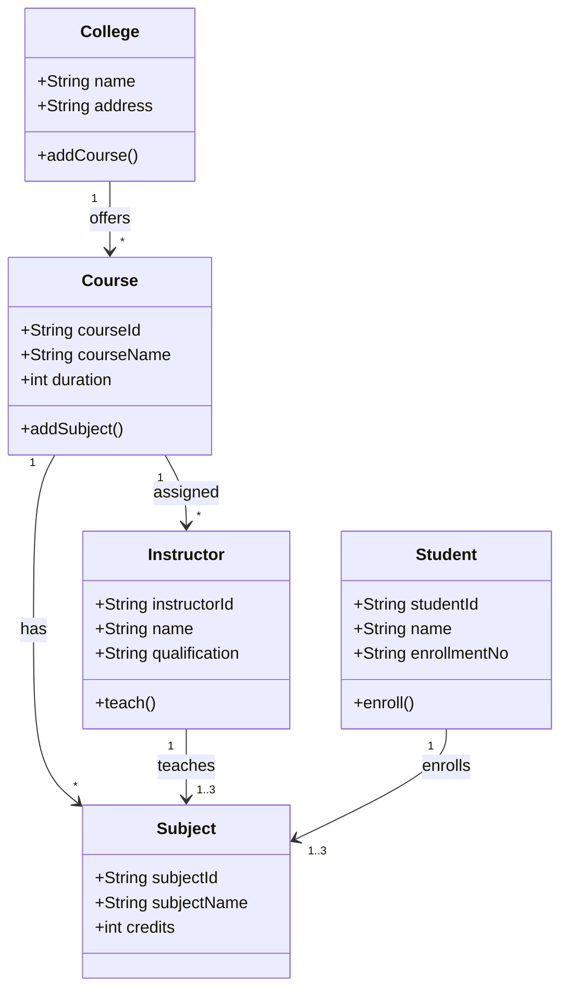

## 6.6 Class Diagram — Publisher-Author-Book System

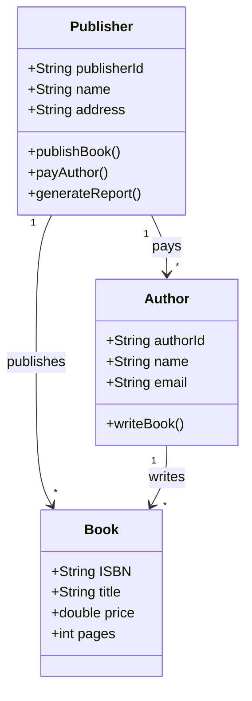

---

# Q7. Explain Sequence Diagram with its elements and draw for a given scenario.

> **Probability: 🔴 VERY HIGH** — Asked in 2023, 2025 + Q-Bank (Q20)

## 7.1 Introduction & Definition

A **Sequence Diagram** is a **behavioral UML diagram** that shows how **objects interact** with each other in a particular **sequence of time**. It represents the **order of messages** exchanged between objects to carry out a functionality. It emphasizes **time ordering** of messages.

## 7.2 Elements of Sequence Diagram

| # | Element | Symbol | Description |
|---|---------|--------|-------------|
| 1 | **Actor** | Stick figure | External entity initiating the interaction |
| 2 | **Object/Lifeline** | Rectangle + dashed vertical line | An instance of a class participating in the interaction |
| 3 | **Activation Bar** | Thin rectangle on lifeline | Period during which the object is **active/processing** |
| 4 | **Message (Synchronous)** | Solid arrow | Sender waits for response |
| 5 | **Message (Asynchronous)** | Open arrowhead | Sender does not wait for response |
| 6 | **Return Message** | Dashed arrow | Response sent back |
| 7 | **Self-Message** | Arrow looping back to same lifeline | Object sends message **to itself** |
| 8 | **Guards** | `[condition]` | Conditions that must be true for a message to execute |
| 9 | **Combined Fragment (Alt)** | Rectangle with `alt` | Represents **alternative** (if-else) paths |
| 10 | **Combined Fragment (Loop)** | Rectangle with `loop` | Represents **iteration** |

## 7.3 Sequence Diagram — Login Process

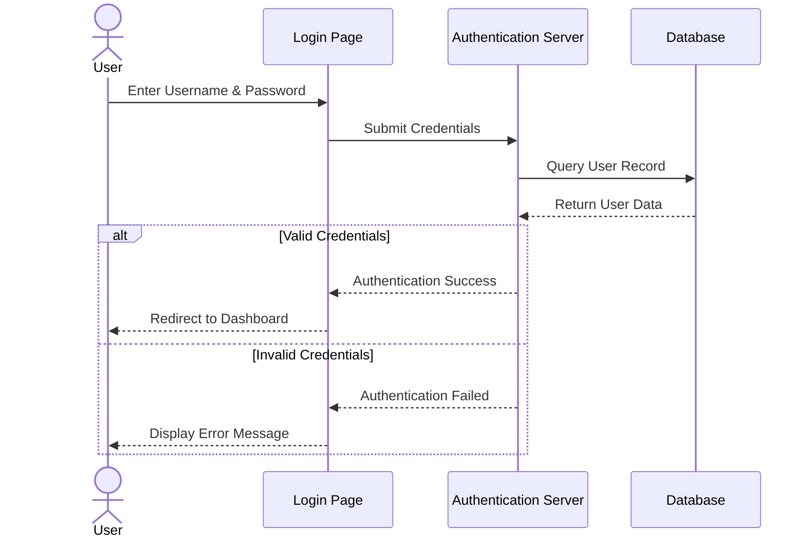

## 7.4 Sequence Diagram — Library Book Issue

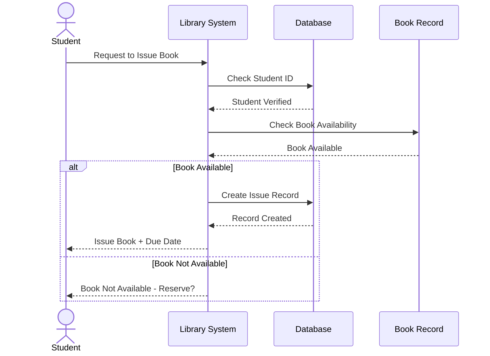

---

# Q8. Define Quality, Quality Assurance (QA) and Quality Control (QC). Compare QA and QC.

> **Probability: 🔴 VERY HIGH** — Asked in 2022, 2023 + Q-Bank (Q30)

## 8.1 Definitions

### Quality
**Software Quality** measures how well software is **designed** (quality of design) and how well the software **conforms to that design** (quality of conformance). A quality product meets the **functional and performance requirements**, is **well-documented**, and conforms to **development standards**.

### Quality Assurance (QA)
**Software Quality Assurance (SQA)** is an **umbrella activity** applied throughout the software process. It is a **planned and systematic** pattern of activities necessary to provide a **high degree of confidence** in the quality of the software. QA is **process-oriented** — it focuses on **preventing defects**.

### Quality Control (QC)
**Quality Control** is a set of activities designed to **evaluate** the quality of a developed work product. QC is **product-oriented** — it focuses on **identifying defects** in the finished product through testing and inspection.

## 8.2 SQA Activities

1. **Create an SQA Plan** for the project
2. **Participate in description** of the software process
3. **Review software engineering activities** to verify compliance
4. **Authenticate designated software work products**
5. **Ensure deviations** are documented and handled properly
6. **Identify noncompliance** and report to senior management

## 8.3 Difference Between QA and QC

| # | Feature | **Quality Assurance (QA)** | **Quality Control (QC)** |
|---|---------|---------------------------|--------------------------|
| 1 | **Focus** | **Process-oriented** | **Product-oriented** |
| 2 | **Goal** | **Prevent** defects | **Detect** defects |
| 3 | **Nature** | **Proactive** activity | **Reactive** activity |
| 4 | **When** | Throughout **SDLC** | After product is **developed** |
| 5 | **Involves** | **Planning, documentation**, process definition | **Testing, inspection**, reviews |
| 6 | **Responsibility** | **Entire team** | **Testing team** |
| 7 | **Technique** | Audits, walkthroughs, process checklists | White box, black box, regression testing |
| 8 | **Verification** | Ensures **process** is correct | Ensures **product** is correct |
| 9 | **Example** | Defining coding standards | Running test cases |
| 10 | **Outcome** | Improved **process** | Improved **product** |

---

# Q9. Explain White Box Testing and Black Box Testing. State the differences.

> **Probability: 🔴 VERY HIGH** — Asked in 2022, 2023 + Q-Bank (Q25-27)

## 9.1 Black Box Testing

**Black Box Testing** is a testing method where the **internal structure/code** of the software is **NOT known** to the tester. The tester only focuses on **inputs and outputs** without any knowledge of internal implementation. It is also called **Functional Testing** or **Specification-based Testing**.

### Techniques
- **Equivalence Partitioning**: Input data is divided into valid and invalid partitions. Only one value from each partition is tested.
- **Boundary Value Analysis (BVA)**: Testing at the **boundaries** of input ranges.
- **Decision Table Testing**: Tests combinations of inputs and their effects.
- **Error Guessing**: Based on tester's experience to guess error-prone areas.

### Advantages
- More effective on **larger units** of code
- Tester needs **no knowledge** of implementation
- Tests are done from a **user's point of view**
- Test cases can be designed as soon as **specifications are complete**

### Disadvantages
- Only a **small number of possible inputs** can be tested
- Without clear specifications, test cases are **hard to design**
- May leave many **program paths untested**

## 9.2 White Box Testing

**White Box Testing** is a testing method where the **internal structure/design/implementation** of the software **IS known** to the tester. The tester examines the **code, logic, and paths** within the software. It is also called **Structural Testing**, **Glass Box Testing**, or **Clear Box Testing**.

### Techniques
- **Statement Coverage**: Every statement executed at least once
- **Branch/Decision Coverage**: Every branch (true/false) executed
- **Path Coverage**: Every possible path through the code tested
- **Loop Testing**: Testing loops at boundaries (0, 1, n, n+1 iterations)

### Advantages
- Reveals errors in **"hidden" code**
- Spots **dead code** and other issues
- Testing is **more thorough** with wider path coverage

### Disadvantages
- **Expensive** in time and money
- Requires **in-depth knowledge** of programming
- **Highly skilled resources** required

## 9.3 Difference Between Black Box and White Box Testing

| # | Feature | **Black Box Testing** | **White Box Testing** |
|---|---------|----------------------|----------------------|
| 1 | **Internal Knowledge** | **Not required** | **Required** |
| 2 | **Also Called** | Functional / Closed Testing | Structural / Clear Box Testing |
| 3 | **Done By** | **Software Testers** | **Software Developers** |
| 4 | **Focus** | **Inputs & Outputs** | **Code, Logic & Paths** |
| 5 | **Type** | **Functional** test | **Structural** test |
| 6 | **Basis** | Requirement Specification | Detail Design Document |
| 7 | **Programming Knowledge** | **Not needed** | **Mandatory** |
| 8 | **Testing Level** | **Higher levels** (system, acceptance) | **Lower levels** (unit, integration) |
| 9 | **Time** | **Less time-consuming** | **More time-consuming** |
| 10 | **Exhaustiveness** | **Less exhaustive** | **More exhaustive** |
| 11 | **Technique** | Equivalence Partitioning, BVA | Control Flow, Data Flow, Path Testing |
| 12 | **Example** | Search on Google using keywords | Checking and verifying loops in code |

---

# Q10. Explain Aggregation, Composition, and Generalization with examples.

> **Probability: 🔴 VERY HIGH** — Asked in 2023 Q3-OR(ii), 2025 Q2(1), Q3(1)

## 10.1 Aggregation (Has-A — Weak Relationship)

**Aggregation** is a special form of association that represents a **"has-a"** or **"whole-part"** relationship between classes. It is a **weaker** form of ownership — the **child can exist independently** of the parent. If the parent is destroyed, the child **continues to exist**.

- **Symbol**: Hollow diamond on the parent (whole) side
- **Example**: A **Department** has **Employees**. If the department is disbanded, employees still exist.
- **Real-world**: A **Library** has **Books**. Books can exist even if the library closes.

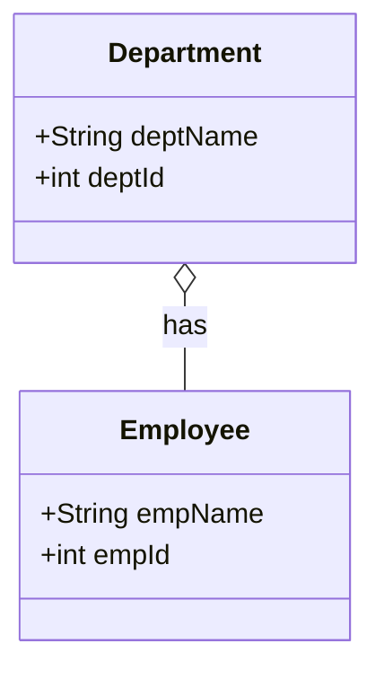

## 10.2 Composition (Part-of — Strong Relationship)

**Composition** is a **stronger** form of aggregation that represents a **"part-of"** relationship with **strong ownership**. The **child cannot exist without the parent**. If the parent is destroyed, all children are **also destroyed**.

- **Symbol**: Filled diamond on the parent (whole) side
- **Example**: A **House** is composed of **Rooms**. If the house is demolished, the rooms cease to exist.
- **Real-world**: A **University** has **Departments**. Departments cannot exist without the university.

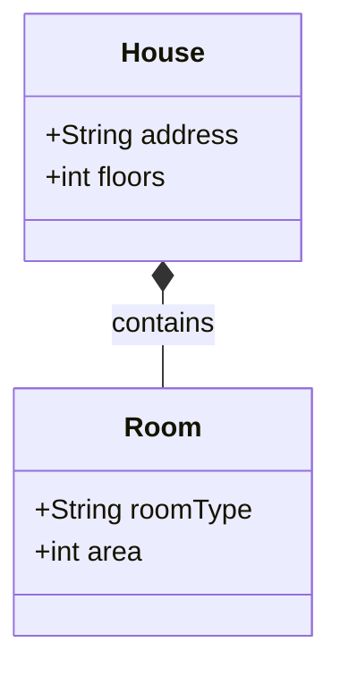

## 10.3 Generalization (Is-A — Inheritance Relationship)

**Generalization** is a **parent-child** (inheritance) relationship between classes where the **child class (subclass)** inherits the properties and behaviors of the **parent class (superclass)**. It represents the **"is-a"** relationship.

- **Symbol**: Solid line with hollow triangle pointing to the parent
- **Example**: **Dog** and **Cat** are types of **Animal** (generalization).
- The child class can **add new attributes/methods** or **override** parent methods.

### Specialization
**Specialization** is the reverse of generalization — it is the process of **defining new subclasses** from an existing superclass by adding **specific features**.

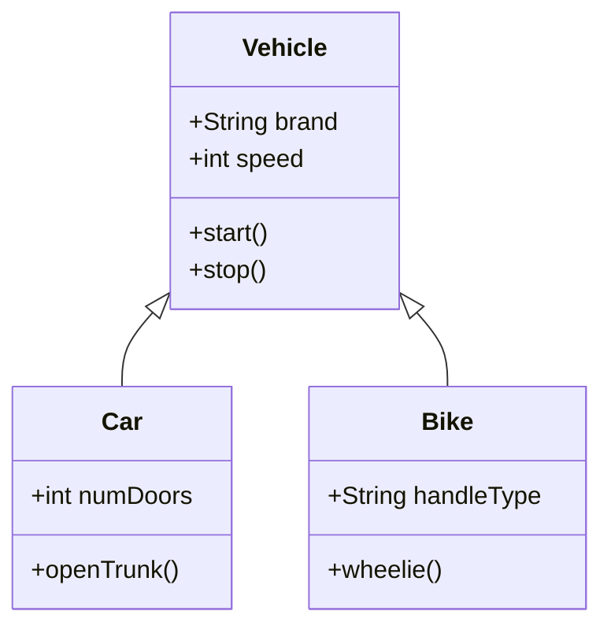

## 10.4 Quick Comparison Table

| Feature | **Aggregation** | **Composition** | **Generalization** |
|---------|:-:|:-:|:-:|
| **Keyword** | Has-a (weak) | Part-of (strong) | Is-a |
| **Symbol** | Hollow Diamond | Filled Diamond | Hollow Triangle |
| **Child Independence** | Yes | No | Inherited |
| **Parent Deletion** | Child survives | Child destroyed | N/A |
| **Example** | Library - Books | House - Rooms | Animal - Dog |

---

# 🎁 BONUS: HIGH-PROBABILITY SUPPLEMENTARY TOPICS

---

## B1. State-Chart Diagram (State Machine Diagram)

> **Asked in 2025 Paper** — Likely to repeat

A **State-Chart Diagram** (also called **State Machine Diagram** or **State-Transition Diagram**) describes the **various states** an object passes through during its lifetime and the **events** that cause transitions between states.

### Elements

| Element | Description |
|---------|-------------|
| **State** | Condition of an object at a moment (rounded rectangle) |
| **Initial State** | Starting point (filled circle) |
| **Final State** | End point (circle within circle) |
| **Transition** | Movement between states (arrow with event/action) |
| **Event** | Trigger that causes a transition |
| **Guard Condition** | Boolean condition `[condition]` for a transition |
| **Action** | Operation performed during transition |

### State-Chart Diagram — Library Book

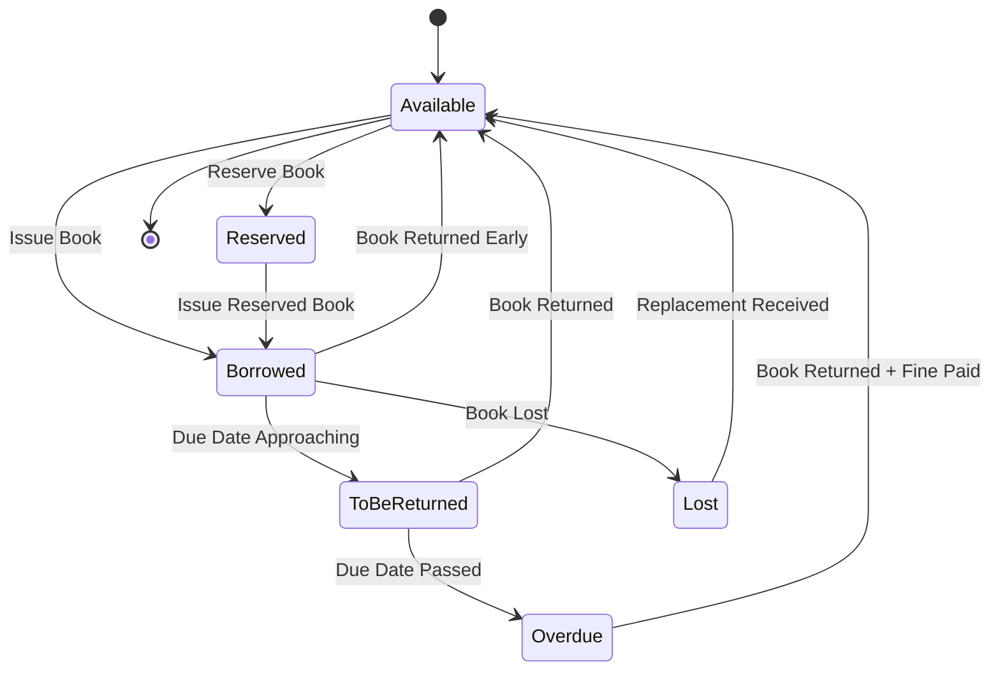

---

## B2. DFD (Data Flow Diagram)

> **Asked in 2025 Paper** — Likely to repeat

A **Data Flow Diagram (DFD)** is a graphical representation of the **flow of data** through a system. It shows how data enters, is processed, stored, and exits the system.

### Symbols

| Symbol | Name | Representation |
|--------|------|----------------|
| Circle/Rounded Rectangle | **Process** | Transforms data |
| Arrow | **Data Flow** | Direction of data movement |
| Open Rectangle | **Data Store** | Repository for data |
| Rectangle | **External Entity** | Source/destination outside system |

> [!IMPORTANT]
> In a **Context-Level DFD (Level 0)**, there is **NO Data Store** symbol. It only shows the system as a single process with external entities and data flows.

### Context-Level DFD — Order Placing System

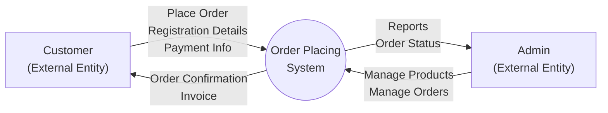

---

## B3. Object Diagram

> **Asked in 2025 Paper** — Likely to repeat

An **Object Diagram** is derived from a **Class Diagram**. It shows **instances (objects)** of classes at a **specific point in time** with actual attribute values. It represents a **snapshot** of the system.

### Elements

| Element | Description |
|---------|-------------|
| **Object** | Instance of a class, shown as `objectName : ClassName` |
| **Attribute Values** | Actual values assigned to attributes |
| **Links** | Connections between objects (instances of associations) |

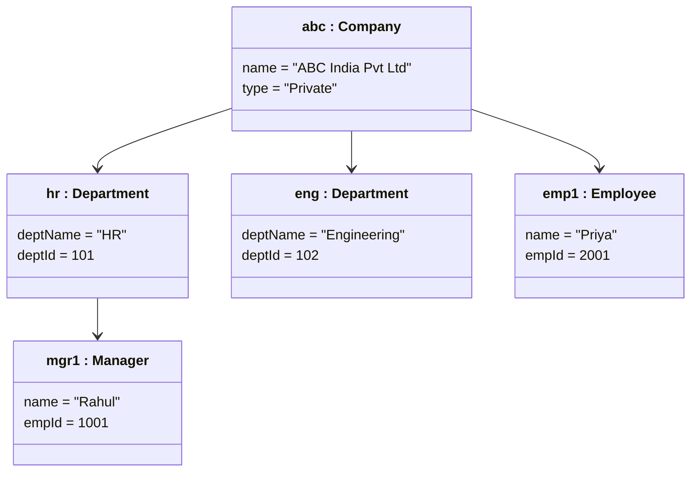

---

## B4. Fact-Finding Techniques

> **Asked in ALL 3 papers** — Almost guaranteed

**Fact-Finding Techniques** are methods used by system analysts to **collect information** about system requirements, problems, and opportunities.

| # | Technique | Description |
|---|-----------|-------------|
| 1 | **Interview** | Face-to-face conversation with stakeholders. Can be **structured** (pre-planned) or **unstructured** (open-ended). |
| 2 | **Questionnaires** | A document containing **written questions** sent to many individuals. Also called **surveys**. Useful for **large groups**. |
| 3 | **Observation** | Analyst **watches users** perform tasks in real working conditions to understand actual workflows. |
| 4 | **Document Review** | Examining **existing documents**, forms, reports, and manuals to understand how the current system works. |
| 5 | **Joint Application Development (JAD)** | A **group workshop** with users, managers, and developers together to define requirements collaboratively. |
| 6 | **Research** | Studying **external sources** — journals, papers, internet — for best practices. |

---

## B5. Verification vs Validation

> **Present in Q-Bank (Q29)** — Could appear as a comparison question

| # | Feature | **Verification** | **Validation** |
|---|---------|-------------------|----------------|
| 1 | **Definition** | Are we building the product **right**? | Are we building the **right product**? |
| 2 | **Type** | **Static** testing | **Dynamic** testing |
| 3 | **Code Execution** | **No** | **Yes** |
| 4 | **Methods** | Reviews, walkthroughs, inspections | Black box, white box, non-functional testing |
| 5 | **Focus** | Conforms to **specifications** | Meets **customer requirements** |
| 6 | **Done By** | **QA team** | **Testing team** |
| 7 | **When** | **Before** validation | **After** verification |
| 8 | **Nature** | **Prevention** of errors | **Detection** of errors |
| 9 | **Defects Found** | **50-60%** | **20-30%** |
| 10 | **About** | Process, standards, guidelines | The product itself |

---

## B6. Levels of Testing

> **Present in Q-Bank (Q28)** — Could appear as a testing strategy question

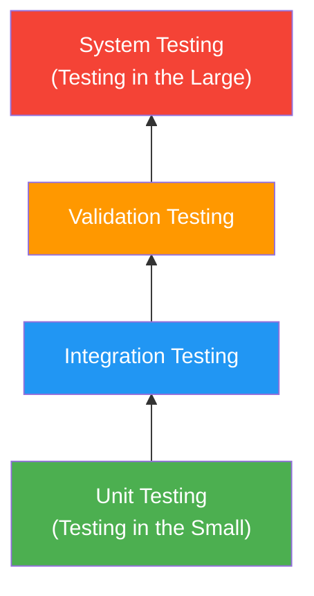

| Level | Description |
|-------|-------------|
| **Unit Testing** | Tests **individual components/modules**. Focuses on internal logic, data structures, boundary conditions. Uses **drivers and stubs**. |
| **Integration Testing** | Tests **interactions between integrated modules**. Focuses on interface errors. Strategies: Top-down, Bottom-up, Sandwich. |
| **Validation Testing** | Verifies software meets **functional, behavioral, and performance** requirements. Includes **alpha** and **beta** testing. |
| **System Testing** | Tests the **entire integrated system** as a whole. Includes performance, security, recovery, and stress testing. |

---

# 📝 PART C: MCQ COMPILATION FROM ALL THREE PAPERS

---

## Paper 1: April 2023 (CC-209) — MCQs

| # | Question | Answer |
|---|----------|--------|
| 1 | A questionnaire is also known as __________. | **Survey** |
| 2 | In DFD __________ is a top level view of an information system. | **Context Diagram** |
| 3 | Which fact-finding technique can help to understand how current system is supposed to work? | **(c) Documentation** |
| 4 | Class is an abstract data type. (True/False) | **True** |
| 5 | Full form of UML. | **Unified Modeling Language** |
| 6 | Which software model is referred to as "Linear life cycle" model? | **Waterfall Model** |
| 7 | Which relationship is a parent child relationship between classes? | **(c) Generalization** |
| 8 | Aggregation is used to represent partial relationship. (True/False) | **True** |
| 9 | CED = ______ / ______ | **(b) WDE / NCE** |
| 10 | __________ divides activity diagram into sections. | **Swim Lane** |
| 11 | What is reflexive association? | **When a class is associated with itself** |
| 12 | A __________ identifies that a single flow of control divides into two or more separate flows. | **Fork** |

---

## Paper 2: April 2022 (CC-209) — MCQs

| # | Question | Answer |
|---|----------|--------|
| 1 | A collection of components work together is called __________. | **(B) System** |
| 2 | In ________ model requirements are broken down into multiple standalone modules. | **(B) Incremental** |
| 3 | ______ show how the processes will interact with each other. | **(C) Sequence Diagram** |
| 4 | ______ is a combination of sequential and prototype model. | **(A) Spiral** |
| 5 | ______ testing is done during the development (coding) of an application. | **(C) Unit** |
| 6 | ______ Software Testing is used to check internal functions of software. | **(D) White box** |
| 7 | Full form of DFD. | **(D) Data Flow Diagram** |
| 8 | In ______ model Developer will design one working model or prototype. | **(B) Spiral** |
| 9 | A class is related to itself by ______ kind of association. | **(D) Reflexive** |
| 10 | ______ represents an individual participant in the Interaction of Sequence Diagram. | **(B) Lifeline** |

---

## Paper 3: November 2025 (DSC-C-351T) — MCQs

| # | Question | Answer |
|---|----------|--------|
| 1 | ________ is a document containing number of questions that can be sent to many individuals. | **(b) Questionnaires** |
| 2 | ________ symbol is not included in context level DFD. | **(c) Data Store** |
| 3 | ________ is a type of relationship between two use-cases. | **(c) Both include and extends** |
| 4 | The ________ combined fragment is used to make only one choice between two or more message sequences. | **(a) Alternatives** |
| 5 | ________ are the conditions used for messages to be executed. | **(c) Guards** |
| 6 | When a class is associated with itself then it is called ________ association. | **(c) Reflexive** |
| 7 | ________ is the right symbol for external entity. | **(b) Rectangle** |
| 8 | An object diagram is derived from the ________ diagram. | **(a) Class** |
| 9 | The state-chart diagram is also called ________. | **(d) All of these** |
| 10 | A ________ is a synchronization element where a single flow divides into two or more simultaneous flows. | **(b) Fork** |
| 11 | Which is the true statement about context diagram? | **(a) It represents the entire system** |
| 12 | ________ is the other name of "has-a" relationship. | **(b) Aggregation** |

---

## Frequently Repeated MCQ Concepts

> [!TIP]
> These concepts appeared as MCQs in **multiple papers** — memorize them!

| Concept | Answer | Papers |
|---------|--------|--------|
| Reflexive Association | Class associated **with itself** | 2022, 2023, 2025 |
| Fork | Splits flow into **parallel** paths | 2023, 2025 |
| Context DFD has NO... | **Data Store** | 2025 |
| Questionnaire = | **Survey** | 2023, 2025 |
| Linear Life Cycle = | **Waterfall Model** | 2023 |
| UML Full Form | **Unified Modeling Language** | 2023 |
| DFD Full Form | **Data Flow Diagram** | 2022 |
| Unit Testing = during... | **Development/Coding** phase | 2022 |
| White Box = checks... | **Internal functions** of software | 2022 |
| Lifeline = | **Individual participant** in Sequence Diagram | 2022 |
| Has-a relationship = | **Aggregation** | 2025 |
| Object Diagram derived from | **Class Diagram** | 2025 |
| State-Chart also called | State Diagram / State Machine / State-Transition (All) | 2025 |
| Generalization = | **Parent-child** relationship | 2023 |

---

# 🔑 PART D: QUICK REVISION — KEY TERMS & DEFINITIONS

| Term | Definition |
|------|-----------|
| **SDLC** | Software Development Life Cycle — systematic process for building software |
| **UML** | Unified Modeling Language — standard notation for modeling software |
| **SRS** | Software Requirement Specification — complete description of system behavior |
| **DFD** | Data Flow Diagram — graphical representation of data flow through system |
| **SQA** | Software Quality Assurance — umbrella activity ensuring quality throughout SDLC |
| **SCM** | Software Configuration Management — managing changes throughout life cycle |
| **FTR** | Formal Technical Review — quality control activity by software engineers |
| **CMM** | Capability Maturity Model — 5-level grading of process maturity (SEI) |
| **COCOMO** | Constructive Cost Estimation Model — estimates effort based on KLOC |
| **Reflexive Association** | When a class is associated with itself |
| **Fork** | Splits single flow into multiple **parallel** flows |
| **Join** | Merges multiple **parallel** flows back into one |
| **Swim Lane** | Divides activity diagram into sections by responsibility |
| **Guard** | Boolean condition `[condition]` that must be true for a transition |
| **Lifeline** | Represents an individual participant in a Sequence Diagram |
| **Activation** | Period during which an object is performing an operation |
| **Context Diagram** | Level 0 DFD — shows entire system as single process (no data stores) |

---

> [!TIP]
> **Last-Minute Strategy**: Focus on questions Q1 to Q10 above. Practice drawing diagrams by hand — examiners award marks for **neat, labeled diagrams**. For comparison questions, use **tables** with at least 5-6 points. Always write **bold keywords** and use **headings** for structure.

> [!IMPORTANT]
> **Diagram Questions are GUARANTEED**: Every paper has asked for at least Use Case, Activity, and Class diagrams. Practice drawing these for: Library Management System, Online Shopping, College Admission, Social Media App. The **scenario will change** but the **technique remains the same**.

---

*Generated on: April 1, 2026 | Best of luck for your exam tomorrow! 🎯*
